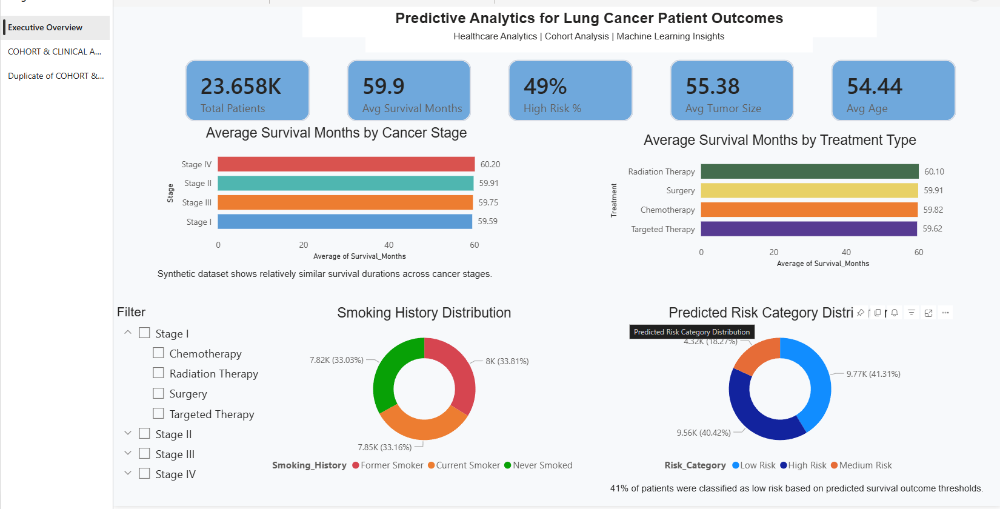
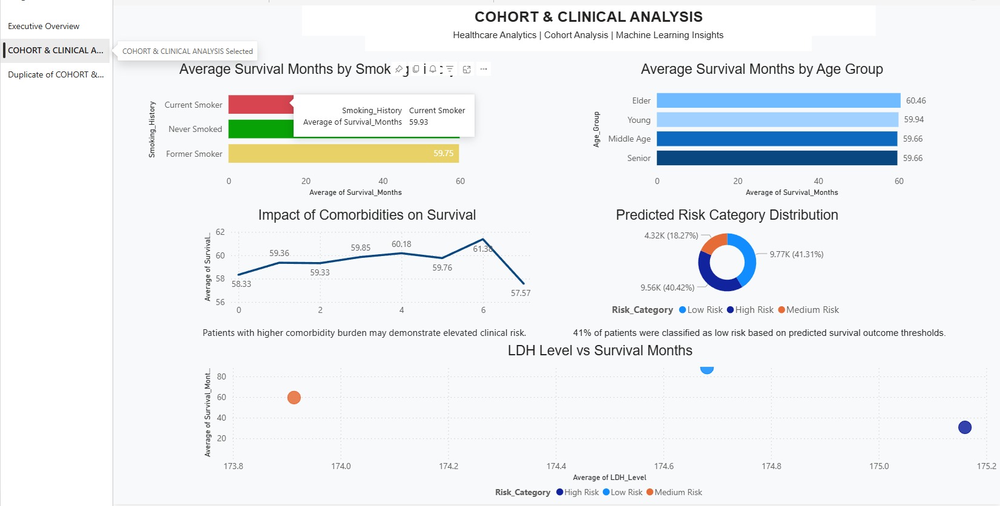
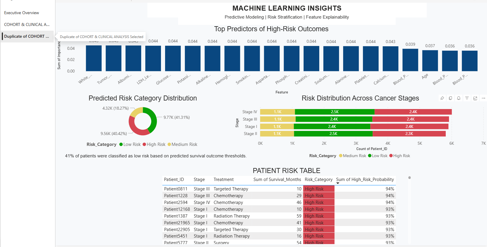
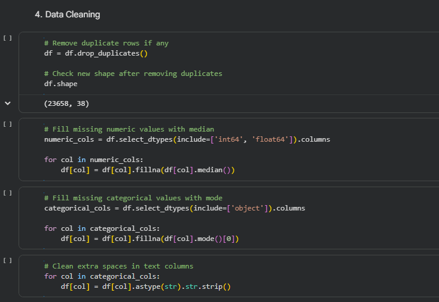
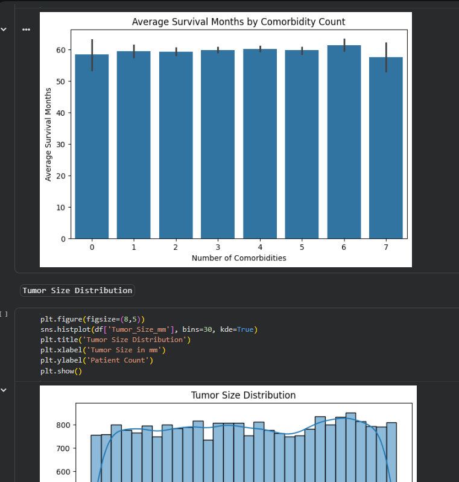
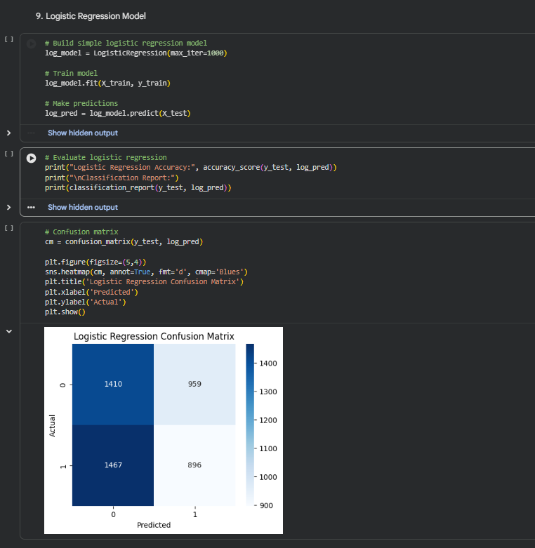
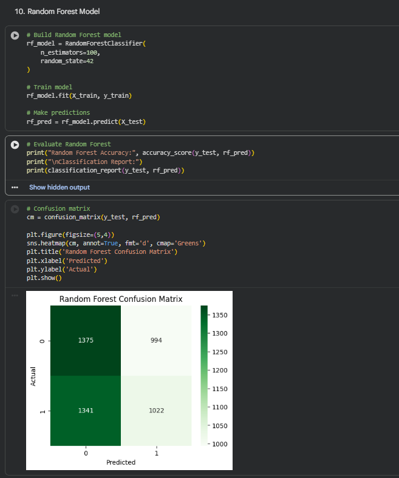
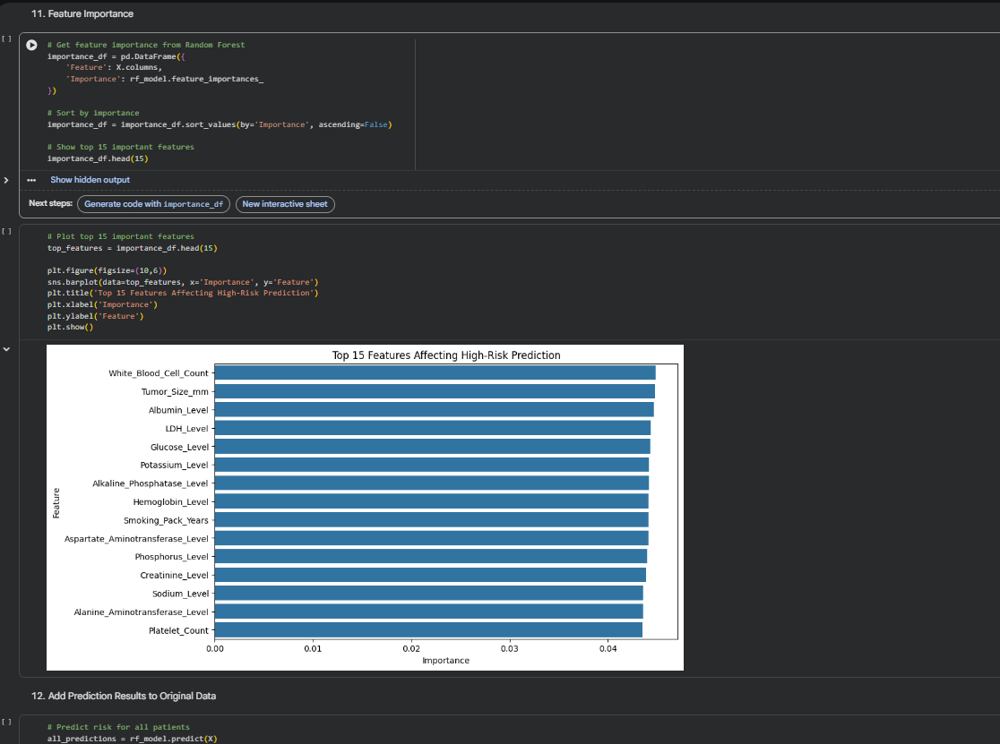

# Predictive Analytics for Lung Cancer Patient Outcomes

## Project Overview

This project analyzes synthetic lung cancer patient data to identify patterns affecting patient outcomes and predict high-risk patient groups using healthcare analytics and machine learning techniques. The project combines Python-based data analysis, feature engineering, cohort analysis, predictive modeling, and Power BI dashboard visualization to simulate a healthcare analytics reporting workflow.

The objective of this project is to demonstrate an end-to-end healthcare analytics process including:
- Data cleaning and preprocessing
- Cohort and clinical analysis
- Machine learning model development
- Predictive risk classification
- Executive-style Power BI reporting dashboards

---

# Project Objectives

- Analyze demographic and clinical factors affecting patient outcomes
- Perform cohort analysis across smoking history, treatment types, age groups, and comorbidities
- Build predictive machine learning models to identify high-risk patients
- Visualize healthcare insights using professional Power BI dashboards
- Demonstrate healthcare analytics storytelling and reporting techniques

---

# Dashboard Screenshots

## Executive Dashboard


---

## Cohort & Clinical Analysis


---

## Machine Learning Insights


---

# Dataset Information

Dataset Source:  
https://www.kaggle.com/datasets/rashadrmammadov/lung-cancer-prediction

Dataset Author:  
Rashad R. Mammadov

### Important Note
This dataset is synthetically generated and used for educational and portfolio purposes. It does not represent real patient records.

The dataset contains:
- Patient demographics
- Smoking history
- Cancer stage and treatment information
- Laboratory biomarkers
- Comorbidity information
- Survival duration data
- Clinical measurements

---

# Technologies Used

## Programming & Analytics
- Python
- Pandas
- NumPy

## Data Visualization
- Matplotlib
- Seaborn
- Power BI

## Machine Learning
- Scikit-learn
- Logistic Regression
- Random Forest Classifier

---

# Data Cleaning & Feature Engineering

Several preprocessing and feature engineering steps were performed to prepare the dataset for analysis and predictive modeling.

## Data Cleaning
- Removed duplicate records
- Handled missing values
- Standardized categorical variables
- Validated data types

## Feature Engineering
Created additional analytical features including:
- High_Risk classification
- Age_Group segmentation
- Stage_Num encoding
- Comorbidity_Count calculation

### High Risk Definition
A derived high-risk classification was created using survival duration thresholds:

- High Risk = Survival_Months < 60
- Lower Risk = Survival_Months >= 60

---

# Exploratory Data Analysis

Exploratory analysis was performed to identify trends and patterns within the dataset.

## Key Areas Explored
- Survival by cancer stage
- Survival by treatment type
- Smoking history analysis
- Age group analysis
- Tumor size distribution
- Clinical biomarker analysis
- Comorbidity burden analysis

Python visualizations were created using Matplotlib and Seaborn to support exploratory analysis and healthcare storytelling.

---

# Cohort Analysis

Cohort analysis was performed to compare patient groups across several healthcare dimensions.

## Cohorts Analyzed
- Smoking History Cohorts
- Treatment Type Cohorts
- Age Group Cohorts
- Cancer Stage Cohorts
- Comorbidity Burden Cohorts

The cohort analysis helped simulate healthcare operational reporting and patient outcome evaluation workflows.

---

# Machine Learning Modeling

Machine learning models were developed to predict high-risk patient outcomes.

## Models Used
- Logistic Regression
- Random Forest Classifier


## Model Evaluation
The following evaluation techniques were used:
- Accuracy Score
- Confusion Matrix
- Classification Report
- Feature Importance Analysis

Feature importance analysis was used to identify the strongest predictive factors affecting patient risk classification.

---

# Power BI Dashboard

A multi-page healthcare analytics dashboard was developed in Power BI to present executive-level insights and predictive analytics results.

## Dashboard Pages

### 1. Executive Dashboard
This page provides:
- KPI overview
- Survival analysis by cancer stage
- Treatment outcome analysis
- Smoking history distribution
- Risk category distribution

### 2. Cohort & Clinical Analysis
This page includes:
- Smoking cohort analysis
- Age group analysis
- Comorbidity impact analysis
- Clinical biomarker visualization
- LDH vs survival analysis

### 3. Machine Learning Insights
This page presents:
- Feature importance analysis
- Risk stratification visuals
- Risk distribution across cancer stages
- Patient-level risk reporting table

---

# Dashboard Screenshots

## Executive Dashboard


---

## Cohort & Clinical Analysis


---

## Machine Learning Insights


---

# Key Findings

- Patients with higher comorbidity burden demonstrated elevated clinical risk patterns.
- Smoking history cohorts showed relatively similar survival trends within the synthetic dataset.
- Clinical biomarkers such as LDH, Albumin, and Hemoglobin contributed significantly to predictive modeling.
- Approximately 49% of patients were classified as high risk based on survival threshold modeling.
- Feature importance analysis highlighted multiple clinical and demographic predictors influencing patient risk classification.

---

# Project Limitations

- The dataset is synthetic and does not represent real-world patient records.
- Explicit mortality status and follow-up censoring variables were not included.
- High-risk classification was derived using survival duration thresholds for predictive analytics purposes.
- Clinical conclusions should not be interpreted as medical recommendations.

---

# Future Improvements

Potential future enhancements include:
- SQL-based healthcare reporting workflows
- Advanced DAX calculations
- Interactive Power BI drill-through functionality
- Advanced machine learning models such as XGBoost
- Integration with real-world healthcare datasets
- Time-series and survival analysis techniques

---

# Repository Structure

```text
predictive-analytics-lung-cancer/

│── notebooks/
│── powerbi/
│── images/
│── README.md
